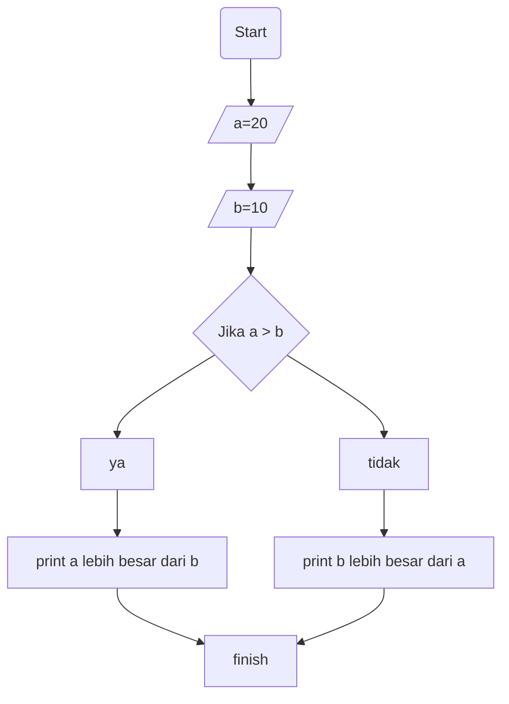

```mermaid
    flowchart TD;
    A(Start) --> B[/a=20/]
    B --> C[/b=10/]
    C --> D{Jika a > b}
    D --> ya
    D --> tidak
    ya --> E[print a lebih besar dari b]
    tidak --> F[print b lebih besar dari a]
    E --> G[finish]
    F --> G[finish]
```